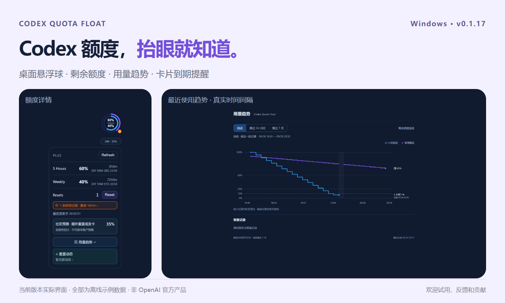
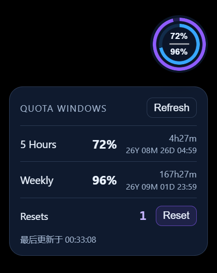
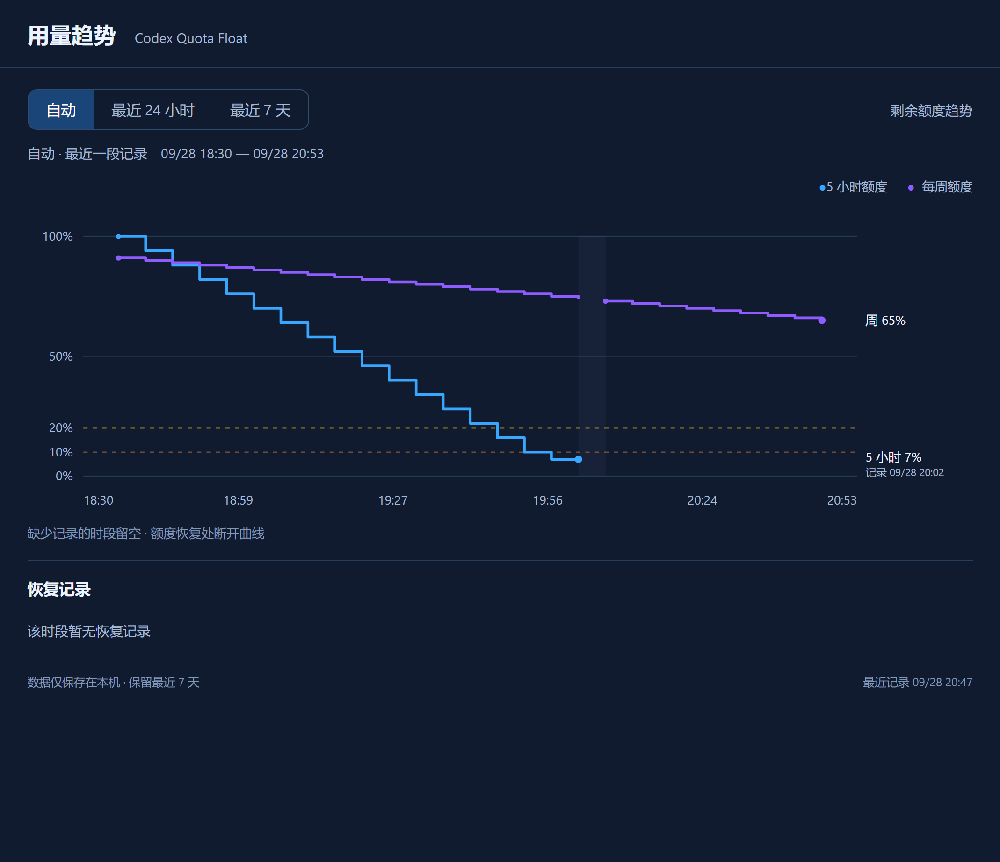
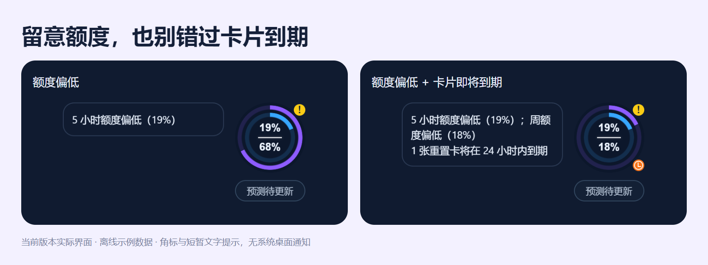

# Codex Quota Float · Codex 额度悬浮球

把 Codex 剩余额度放在桌面一角：一眼查看额度、恢复时间和用量趋势，及时留意重置卡到期与重置动态。

面向 **Windows** 的独立社区项目，使用 Electron 构建；不是 OpenAI 官方产品。当前版本 **0.1.20**。



[快速开始](#快速开始) · [功能介绍](#功能介绍) · [参与项目](#参与项目) · [开发与测试](#开发与测试)

## 功能介绍

### 额度和恢复时间，一眼看到

- 蓝色内环表示 5 小时剩余额度，紫色外环表示每周剩余额度；中间分别显示百分比。
- 点击悬浮球，查看倒计时、具体恢复时间、可用重置卡，并手动刷新。
- 按当前账户实际返回的额度窗口显示；仅有周额度时，自动隐藏 5 小时额度及对应趋势。
- 每 5 分钟定期刷新，并在额度恢复、卡片提醒和到期等时间点安排刷新。连接失败保留上次确认的布局，手动刷新可重新连接。



### 用量趋势，看清最近一段消耗

- 本地保留 7 天额度记录，每 5 分钟采样；默认聚焦最近一段使用，也可切换到 24 小时或 7 天。
- 显示最新剩余百分比、20% / 10% 参考线，以及额度恢复前后的数值。
- 保留真实时间间隔；中断记录不会连成虚假的连续曲线。旧记录会注明记录时间。
- 从首次成功读取开始积累，无法还原此前使用情况，也不估算 token 数或账单。



### 低额度、卡片到期和消息提醒

| 提醒 | 含义 |
| --- | --- |
| 黄色 / 橙色 / 红色角标 | 剩余额度 ≤20% / ≤10% / 已耗尽，两个额度窗口分别判断 |
| 绿色对勾 | 观察到耗尽后恢复，且当前所有已有额度窗口均高于 20% |
| 橙色时钟 | 可用重置卡进入最后 24 小时 |
| 青色数字 | 未读相关消息及观察到的新卡记录，超过 99 条显示 99+ |

提醒使用悬浮球角标和短暂文字面板，没有系统桌面通知或声音。悬停可查看文字提示。重置消息须手动标为已读，打开、刷新或重启不会代为确认；Tibo 动态点击具体条目即已读。使用重置卡前须选卡并确认，默认选中最快过期的可用卡，程序不会自动消耗卡片。



### 重置动态与社区预测

- 汇总相关消息、原文来源及账户新卡记录，支持未读状态、历史筛选和分页。
- 社区未来 24 小时估计来自 [Codex Reset Observatory](https://github.com/gussuri/codex-reset-observatory)，不是本项目独立训练的预测模型，也不代表你的账户一定会恢复额度。
- 有有效预告时优先显示事件；失效或超过 6 小时的预测会隐藏。准确率未经本项目独立验证。
- 社区数据默认每 30 分钟检查；手动检查通常至少间隔 10 分钟，失败后使用退避重试。
- 原帖核验是可选功能，需要在启动应用的环境中设置 `FIRECRAWL_API_KEY`。未配置时保留明确的“未核验”状态；不应把社区摘要当成已核验原文。
- 内置历史归档不完整，不能据此推断某段时间没有发生重置。详见[来源与覆盖范围](docs/reset-history-sources.md)。

### Tibo 动态与中文阅读

- 在额度面板中打开「Tibo 动态」，阅读 `@thsottiaux` 最近 30 天的原帖、回复、引用和转推；顶部可切换重置消息。
- 推文和机器翻译使用 [FxEmbed / FxTwitter 公共 API](https://docs.fxembed.com/api/introduction/)，不需要 X API Key 或 Firecrawl 额度。第三方服务可能暂时失败，不保证覆盖已删除或不可见的内容；转推按原帖发布时间保留。
- 运行时每 30 分钟同步一次，关闭到托盘后继续；完全退出后停止。手动更新间隔 1 分钟，失败后自动退避到 1 小时。分页进度会保存，首次历史默认已读。
- 动态入口单独显示未读数，超过 99 显示 `99+`。点击列表中的具体动态即标记该条已读；仅打开动态页、后台刷新或翻译不会自动标记。保留全部标记已读；悬浮球角标仍只显示重置消息。
- 公告和动态均采用列表＋详情，宽窗口分别滚动；窄窗口进入详情后可返回原列表位置。支持未读筛选，新内容先提示，点击后加入列表，不抢走当前正文。
- 默认显示已有中文译文，原文和回复上下文按需展开。正文与上下文分别显示翻译状态；公告支持单条重试，译文与原文匹配后才保存。
- 动态同步仍每 30 分钟一次；独立翻译队列每 30 秒最多处理一条（含上下文），优先当前阅读内容、未读和新内容。同步首批最多翻译 5 条，普通失败 15 分钟后重试，限流后暂停 1 小时。手动重试最短间隔 1 分钟，无法取得译文时保留原文。
- `codex-tibo-feed.json` 在应用用户数据目录独立保存正文、译文、读取状态和同步进度。超过 30 天的记录（包括未读）自动清理；图片、视频仅保留链接，不自动下载。
- 来源与存储设置显示条数、占用和覆盖范围，可清空普通动态缓存。相关重置消息及其必要来源内容独立长期保留，两类已读状态互不影响。

### 桌面使用

- 置顶悬浮球、托盘驻留；关闭窗口会隐藏到托盘，右键菜单中的“退出”才会结束程序。
- 安装包或便携版首次运行后，默认启用“跟随 Codex 启动”；可在右键菜单关闭。
- 启动监视器每 5 秒检查 Codex 桌面窗口；在同一次 Codex 会话中手动退出悬浮球，不会立刻被重新拉起。
- 便携版请放在固定目录；移动后重新运行一次，以更新启动路径。
- 小屏幕或高缩放比例下详情面板可滚动；透明空白区域不拦截鼠标。

## 快速开始

目前可从源码运行或自行构建 Windows x64 安装包 / 便携版。

1. 准备 Windows、Node.js 和 pnpm，并确保本机 Codex 已登录。
2. 克隆仓库并安装依赖：

```powershell
git clone https://github.com/xuanyuanxiao-cm/codex-quota-float.git
cd codex-quota-float
pnpm install
```

3. 启动：

```powershell
pnpm exec electron .
```

应用通过本机 `codex app-server --stdio` 读取额度。优先使用 `CODEX_CLI_PATH` 指定的可执行文件，其次查找 Codex 桌面应用的本地 CLI，最后尝试 PATH 中的 `codex` 命令。若提示连接失败，请确认本机登录状态及 CLI 路径，再点击刷新。

可选路径配置（请替换为自己的实际路径）：

```powershell
$env:CODEX_CLI_PATH = 'C:\path\to\codex.exe'
pnpm exec electron .
```

## 参与项目

欢迎一起把这个小工具做得更顺手。**不写代码也能参与。**

- **试用反馈**：报告连接、显示、缩放、多屏或托盘问题，附上版本号、复现步骤与去除个人信息后的截图。
- **交互与设计**：反馈看不懂的提示、容易误点的入口，或给出更清楚的界面方案。
- **代码与文档**：修复问题、补充使用说明和测试；较大的功能改动请先在 Issue 里讨论范围。

→ [提交问题或建议](https://github.com/xuanyuanxiao-cm/codex-quota-float/issues)
→ [查看贡献说明](CONTRIBUTING.md)

## 开发与测试

当前可运行实现位于 `dist/`，界面文件在 `dist/renderer/`，测试在 `test/`。

```powershell
pnpm test                 # Node.js 单元测试
pnpm test:window          # 窗口布局、透明区域与账户显示
pnpm test:alerts          # 提醒状态与角标生命周期
pnpm test:trends          # 趋势范围、间隔与悬停读数
pnpm test:notices         # 消息、核验与未读状态
pnpm test:regressions     # 小屏滚动、托盘恢复与退出清理
```

Electron 界面测试使用离线示例数据，不连接额度服务、不消耗真实重置卡。截图输出到 `release/`。窗口测试支持 `--force-device-scale-factor=1.25`，也可添加 `--interactive` 手动检查透明区域的点击穿透。测试迁移说明见 [test/README.md](test/README.md)。

构建 Windows x64 安装包和便携版：

```powershell
pnpm build
```

产物位于 `release/`，文件名包含当前版本号。额度请求有 15 秒超时和有限重试；消耗重置卡的请求不会自动重放，超时后需刷新确认结果。

本页图片均由 **0.1.17 实际界面与离线演示数据**生成，不代表任何真实账户的额度或当前重置承诺。
